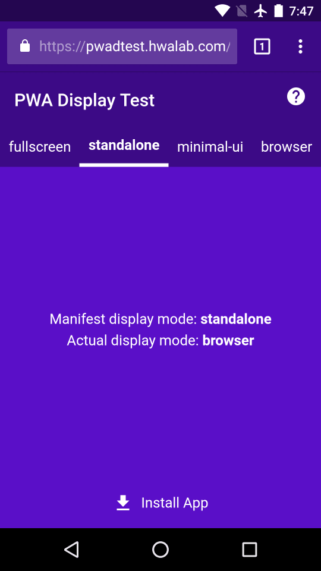
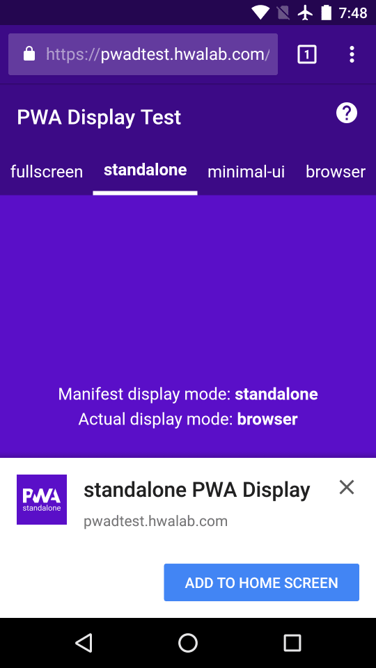
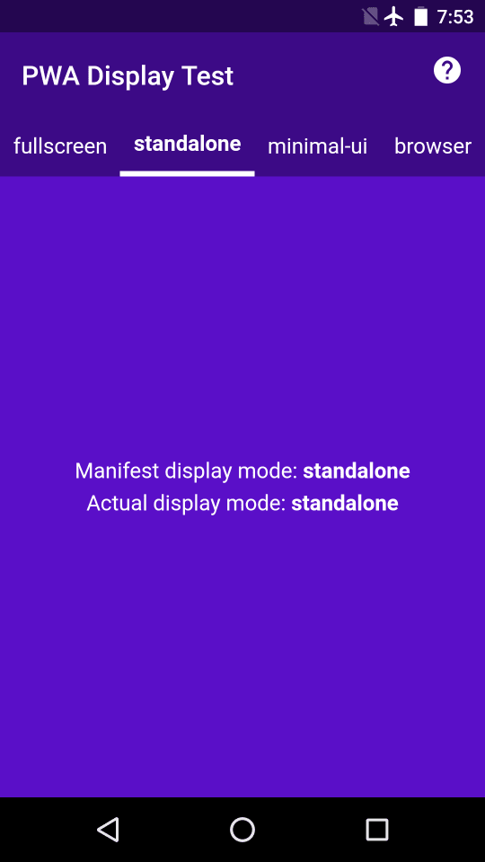
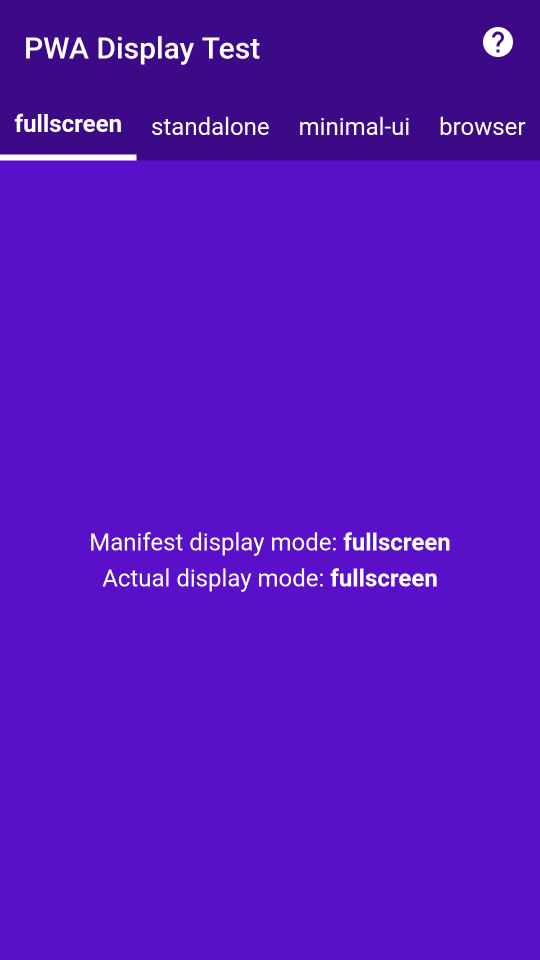
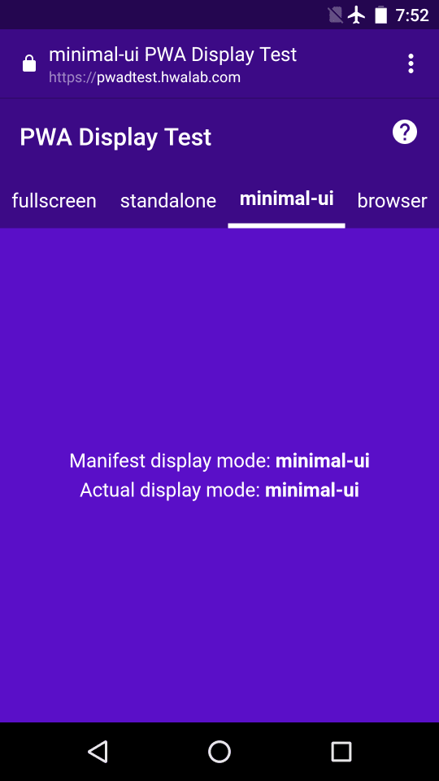
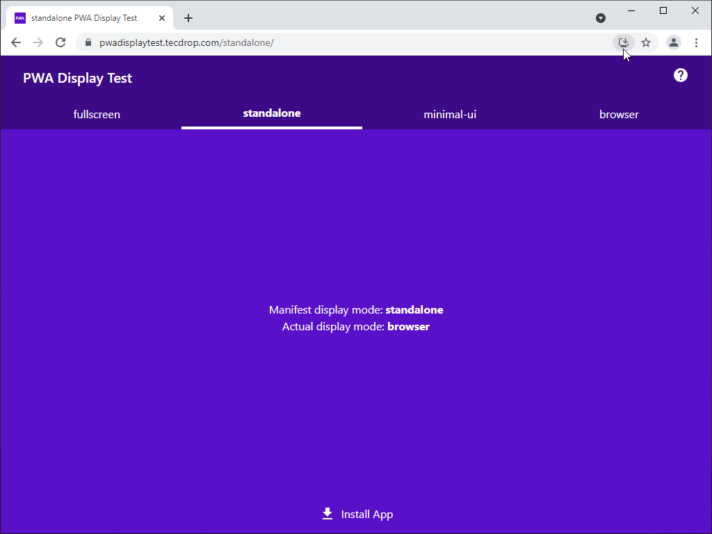
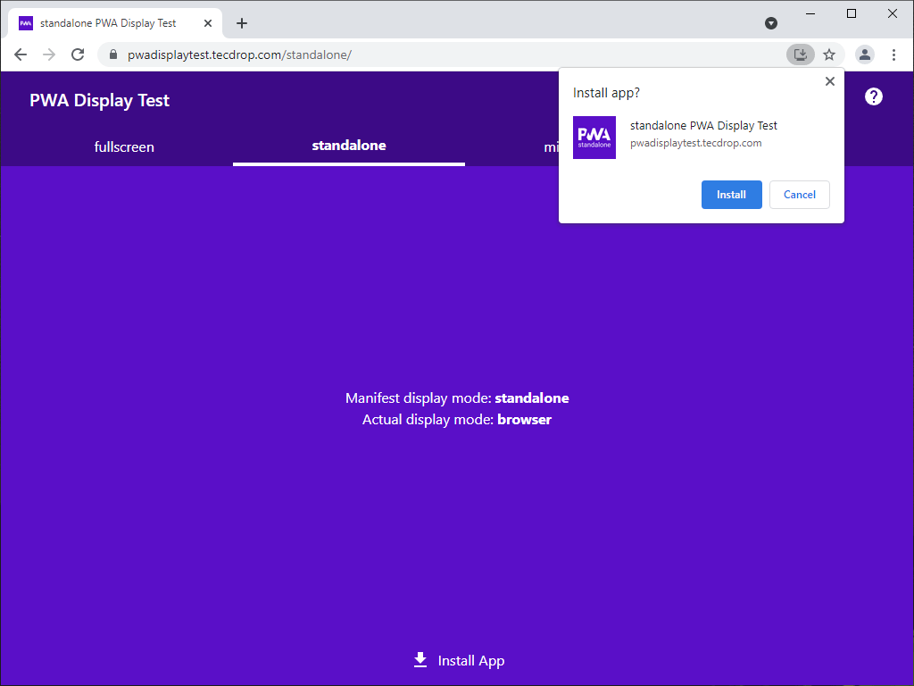
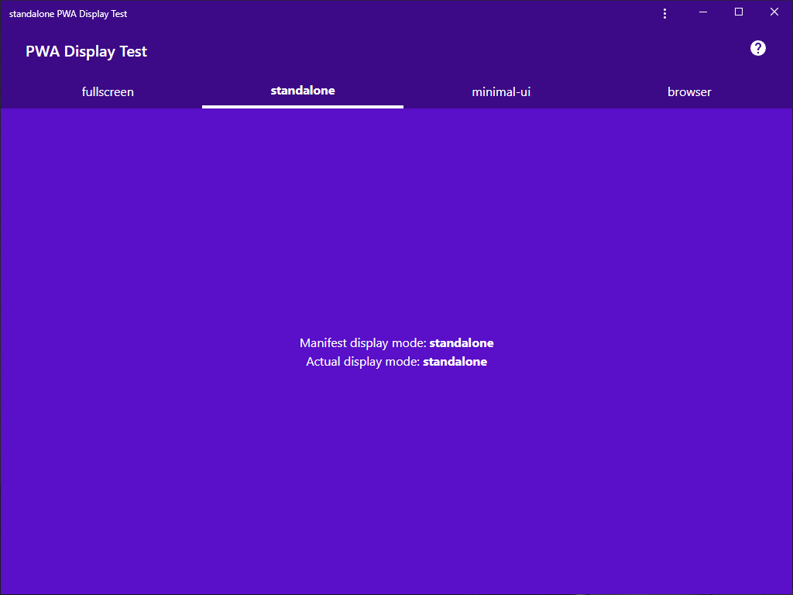
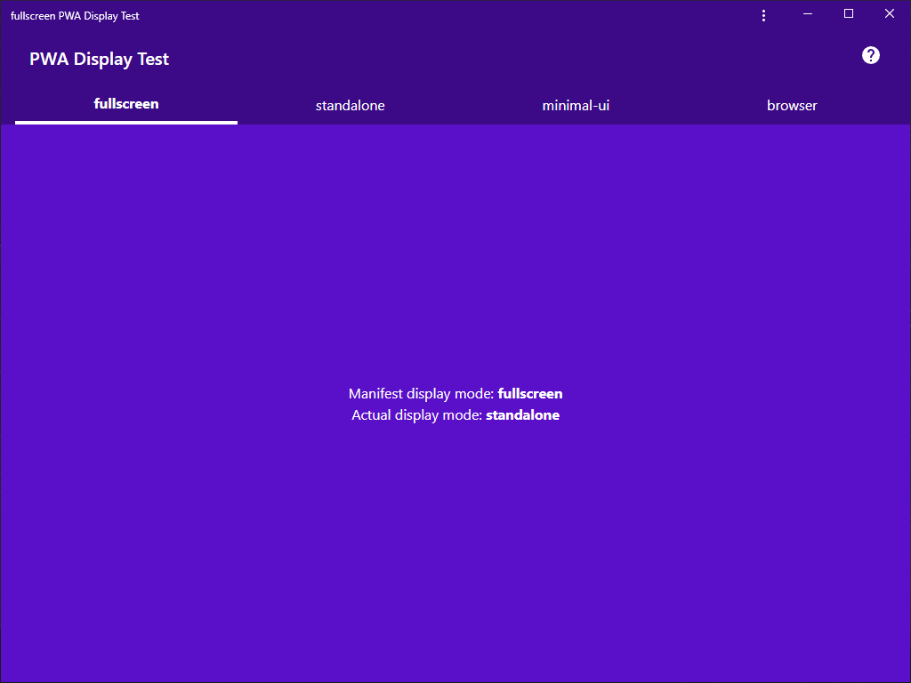

# PWA Display Test
**See how Progressive Web Apps (PWAs) look and feel on your devices and platforms.** Try it on Android, iOS, Linux, macOS, Windows, and other operating systems. Test if the standalone display mode really opens the PWA to look and feel like a standalone native application. Test if a fullscreen PWA really takes up the entirety of your screen. Try all the web app manifest display modes: fullscreen, standalone, minimal-ui and browser. To install PWA Display Test, navigate to its address and click the Install App button in supported browsers.

## PWA Display Mode Status

Preferred display mode vs. actual display mode on various platforms and browsers:

| Display mode / Platform | fullscreen    | standalone     | minimal-ui    | browser     |
| ---                     | ---           | ---            | ---           | ---         |
| Android/Chrome          | ✔️ fullscreen | ✔️ standalone | ✔️ minimal-ui | ✔️ browser |
| Windows/Chrome          | ✖️ standalone | ✔️ standalone | ✖️ standalone | ✔️ browser |

_Last updated:_ June 7, 2018

## PWA Display Test on Android

| Go [to the PWA](https://pwadtest.appliberated.com/standalone/) and click _Install App_ | Click _Add to Home screen_ in prompt | A PWA looks like a native app |
| :---: | :---: | :---: |
|  |  |  |
| **A _fullscreen_ PWA covers everything** | **A _minimal-ui_ PWA shows the URL** | **It works offline even in the browser** |
|  |  |  |

_Note:_ The screenshots were taken on Android 6.0.1 / Chrome 67.0.3396.68.

## PWA Display Test on Windows

| Navigate [to the PWA](https://pwadtest.appliberated.com/standalone/) in Chrome and click _Install App_ | Click _Install_ in the web app install prompt |
| :---: | :---: |
|  |  |
| **An installed PWA looks like a native Windows app** | **No _fullscreen_ mode in Windows?** |
|  |  |

_Note:_ The screenshots were taken on Windows 10.0.17134 / Chrome 67.0.3396.62.

## Development

PWA Display Test is hosted on GitHub Pages, and served from the [docs folder](https://github.com/appliberated/PWADisplayTest/tree/master/docs) in the `master` branch.

The project uses [Gulp](gulpfile.js) and a [template](src/template) to generate the 4 PWAs ([fullscreen](docs/fullscreen), [standalone](docs/standalone), [minimal-ui](docs/minimal-ui), and [browser](docs/browser)) in the `docs` folder.

Prerequisites: [Git](https://git-scm.com/), [Node.js](https://nodejs.org/en/), [Workbox](https://developers.google.com/web/tools/workbox/), [ESLint](https://eslint.org/). Editor: [Visual Studio Code](https://code.visualstudio.com/).

## Contributions

Contributions are welcome! For feature requests and bug reports please [submit an issue](https://github.com/appliberated/PWADisplayTest/issues).

## Acknowledgements

PWA Display Test (and all Appliberated free apps) have been developed with kind support from [East-Tec](https://www.east-tec.com), the home of [east-tec Eraser](https://www.east-tec.com/eraser/), the privacy tool that quickly and securely covers your online and PC tracks.

## License

PWA Display Test is licensed under the [MIT License](LICENSE).
